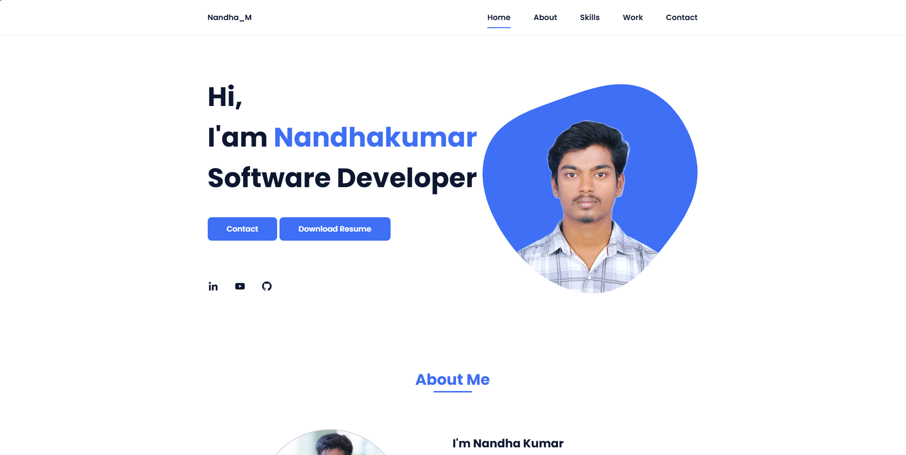

# 🌐 Personal Portfolio Website - Nandha_M

This is a responsive and modern **personal portfolio website** built using **HTML**, **CSS**, and **JavaScript**. It showcases my skills, projects, and contact information in a clean and professional layout.

## 🚀 Features

- 👋 Home section with a dynamic introduction
- 👤 About section describing my background and passion
- 🛠 Skills section with categorized tech stack and progress bars
- 📂 Work section showcasing my real-world projects
- 📞 Contact form powered by [Formspree](https://formspree.io)
- 📱 Responsive design for all screen sizes
- 🎨 Simple and elegant user interface with smooth scroll and animations

## 📸 Screenshots



## 📁 Project Structure

```bash
portfolio/
│
├── assets/
│   ├── css/
│   │   └── styles.css        # Main stylesheet
│   ├── img/
│   │   └── [project images]  # Images for projects, profile, etc.
│   ├── js/
│   │   └── main.js           # Script for nav toggle, scroll reveal, etc.
│   └── Nandha_CV.pdf         # Resume file for download
│
├── index.html                # Main HTML page
└── README.md                 # This file
